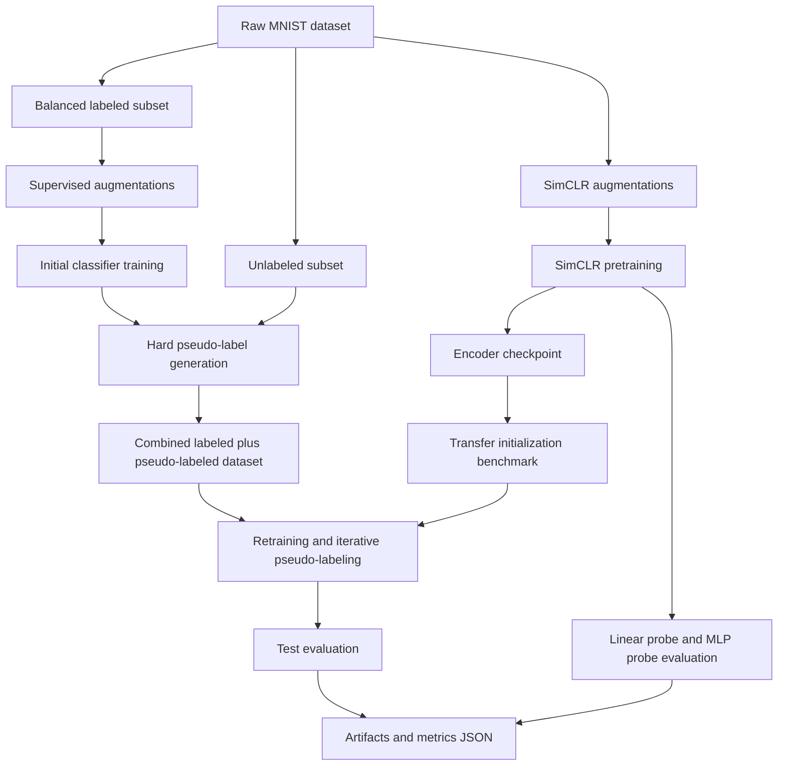
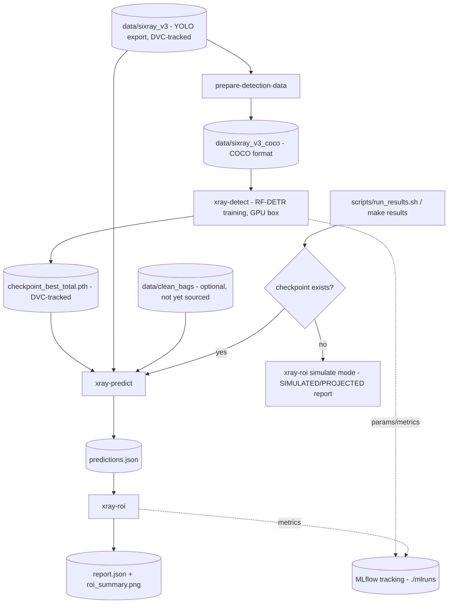

# Low-Label Defect Detection

This project studies label-efficient image learning and manufacturing defect inspection by combining:

- SimCLR-style self-supervised representation learning
- linear probing and frozen-encoder MLP evaluation
- semi-supervised CNN training with hard pseudo-labeling
- iterative pseudo-label expansion under confidence thresholds
- confidence-aware inspection workflows for manufacturing images

The codebase is organized as a reproducible Python project with YAML configs, CLI entry points, tests, and CI.

Reference paper: https://arxiv.org/abs/2002.05709

## Core Ideas

### What is SimCLR?

SimCLR is a self-supervised learning method. Instead of training with labels like `0`, `1`, or `2`, it teaches a model to recognize that two different augmented versions of the same image still come from the same source image.

In simple terms:

- take one image
- create two different augmented views of it
- train the model to keep those two views close in feature space
- push views from different images farther apart

The goal is to learn a useful representation before doing classification.

### What is linear probing?

Linear probing is a simple way to test whether the learned representation is good.

- freeze the encoder
- put a very small classifier on top
- train only that classifier

If a simple linear layer works well, it usually means the encoder learned features that separate classes clearly.

### What is pseudo-labeling?

Pseudo-labeling is a semi-supervised learning method.

- start with a small labeled dataset
- train a model on it
- run the model on unlabeled images
- keep only predictions the model is very confident about
- treat those predictions like temporary labels
- retrain using both real labels and pseudo-labels

This is useful when labeling data is expensive but unlabeled data is easy to get.

### What does hard pseudo-labeling mean?

Hard pseudo-labeling means the model picks one class as the label, such as `7`, instead of keeping the full probability distribution.

Example:

- soft label: `[0.01, 0.02, 0.93, ...]`
- hard label: `2`

This project uses confidence thresholds so only high-confidence hard labels are added.

### How this fits manufacturing defect detection

For manufacturing inspection, the same ideas become:

- a small set of expert-reviewed defect images
- a much larger pool of unlabeled production images
- automatic labeling only when the model is very confident
- manual review for the uncertain cases

That makes the project useful for questions like:

- how many images can be auto-triaged safely?
- how much inspection workload can be reduced?
- does self-supervised pretraining help when defect labels are scarce?

## Original Results

These were the initial project results.

### SimCLR pretraining

| Evaluation head | Test accuracy |
|---|---:|
| Linear probe | 98.55% |
| Frozen-encoder MLP | 98.44% |

### Semi-supervised CNN

| Setup | Test accuracy |
|---|---:|
| CNN + augmentation | 93.66% |
| CNN + augmentation + hard pseudo-labeling | 94.12% |
| Iterative pseudo-labeling | 97.18% |

## Repo Layout

```text
.
├── configs/                  # experiment configs
├── data/                     # datasets (DVC-tracked, gitignored)
│   ├── mvtec_ad/
│   │   └── bottle/           # MVTec AD bottle category
│   └── sixray_v3/            # X-ray baggage detection dataset
├── docs/                     # local notes (gitignored)
├── archive/                  # archived notebooks
├── scripts/                  # pipeline entrypoints (training, results)
├── src/simclr_hpl/
│   ├── detection/            # YOLO->COCO data prep, RF-DETR train/predict
│   ├── tracking.py           # MLflow experiment tracking wrapper
│   └── roi.py                # business-impact (ROI) calculations
├── tests/                    # smoke tests
├── archive/SimCLR.ipynb      # archived experiment notebook
├── archive/CNN_semi_supervised.ipynb
├── dvc.yaml                  # reproducible pipeline stages
├── Dockerfile                # CPU image for inference/reporting/tests
├── docker-compose.yml        # app + MLflow UI services
└── pyproject.toml            # uv-compatible project metadata
```

## MNIST / SimCLR Workflow Diagram



## Manufacturing Workflow

For manufacturing-style experiments with MVTec AD, the workflow is:

1. load one product category such as `bottle`
2. turn the task into binary classification: `good` vs `defect`
3. simulate a low-label setting with a small reviewed subset
4. pretrain with SimCLR on the unlabeled pool
5. train a defect classifier
6. pseudo-label only the high-confidence unlabeled images
7. evaluate both accuracy and review-queue metrics

## Current Workflow

The project now supports four main experiment paths:

1. `simclr-train`
   Learn image representations without labels, then evaluate them with a linear probe and an MLP probe.
2. `pseudo-label-train`
   Train with a small labeled set, generate confident pseudo-labels on unlabeled data, and retrain.
3. `transfer-benchmark`
   Compare random initialization vs SimCLR initialization at multiple label budgets.
4. `mvtec-inspection`
   Run a manufacturing defect-detection workflow with MVTec AD and review-queue metrics.

In short, the workflow is:

1. learn features with SimCLR
2. test how useful those features are
3. train a low-label classifier
4. add confident pseudo-labels from unlabeled images
5. compare whether SimCLR initialization helps the low-label pipeline

## X-ray Threat Detection Pipeline

The project also includes an X-ray baggage threat-screening detection pipeline: RF-DETR
object detection on a 5-class threat dataset (`Gun`, `Knife`, `Pliers`, `Scissors`,
`Wrench`), with experiment tracking, business-impact (ROI) reporting, a DVC-versioned data
and pipeline, and a CPU Docker image. It adds four console scripts:

- `prepare-detection-data` — convert the YOLO-format dataset to COCO
- `xray-detect` — train an RF-DETR detector
- `xray-predict` — run a trained detector and write `predictions.json`
- `xray-roi` — turn predictions into a business-impact (ROI) report

### Pipeline Flow



The full graph is also encoded as a DVC pipeline (`dvc.yaml`): `prepare_data` → `train`
→ `predict` → `roi`, with `configs/sixray_detection.yaml` and `configs/roi.yaml` tracked
as stage params. The `train` stage is currently frozen (no GPU on this machine) — its
checkpoint is dropped in manually once produced on a CUDA box.

### Data preparation (YOLO → COCO)

RF-DETR trains on COCO-format datasets. Convert the Roboflow YOLO export once:

```bash
uv run prepare-detection-data --yolo-root data/sixray_v3 --output-root data/sixray_v3_coco
```

### Training the detector

```bash
uv sync --extra detection
uv run xray-detect --config configs/sixray_detection.yaml
```

`rfdetr` is an optional, heavy, GPU-oriented dependency — install it with the `detection`
extra only when training.

### Predictions and ROI reporting

```bash
uv run xray-predict --checkpoint <path-to-checkpoint> --variant nano \
    --threat-dir data/sixray_v3/test/images --clean-dir data/clean_bags --out predictions.json
uv run xray-roi --config configs/roi.yaml --predictions predictions.json
```

Without a trained checkpoint or clean-bag images, a simulated report can be generated
instead:

```bash
uv run xray-roi --config configs/roi.yaml --simulate-threat 300 --simulate-clean 300
```

The current dataset contains essentially no confirmed clean/negative bags, so the
"auto-clear clean bags" ROI figures are a **projection from simulated inputs** until
real clean-bag images are added. Detection accuracy measured on the test split is real,
not simulated.

### Experiment tracking (MLflow)

Every training and reporting run logs params, metrics, and artifacts to a local `./mlruns`
directory. Browse them with:

```bash
uv run mlflow ui
```

### Reproducible pipeline (DVC)

`dvc.yaml` defines the pipeline as four stages: `prepare_data` → `train` → `predict` →
`roi`. Configs (`configs/sixray_detection.yaml`, `configs/roi.yaml`) are tracked as
pipeline params, so changing a hyperparameter invalidates the right stage. Run:

```bash
uv run dvc repro
```

The raw dataset and trained checkpoints are tracked by DVC (`*.dvc` pointer files in git,
data in the local DVC cache). No remote storage is configured.

### Docker

```bash
docker build -t xray-screening .
docker run --rm xray-screening                                                  # run tests
docker run --rm xray-screening xray-roi --config configs/roi.yaml \
    --simulate-threat 300 --simulate-clean 300                                  # simulated ROI report
docker compose up mlflow                                                        # MLflow UI on :5000
```

## Professional Setup With `uv`

### 1. Install and pin Python

```bash
uv python install 3.11
uv python pin 3.11
```

### 2. Create the environment and install dependencies

```bash
uv sync --dev
```

### 3. Run tests and lint checks

```bash
uv run pytest
uv run ruff check .
```

Optional shortcuts are available through the [Makefile](Makefile), for example `make test`, `make benchmark`, `make mvtec`, and `make plots`.

### 4. Run the experiments

```bash
uv run simclr-train --config configs/simclr_mnist.yaml
uv run pseudo-label-train --config configs/pseudo_label_mnist.yaml
uv run transfer-benchmark --config configs/transfer_pseudo_label_mnist.yaml
uv run mvtec-inspection --config configs/mvtec_bottle_inspection.yaml
```

Artifacts and metrics are written under `artifacts/`.

### 5. Generate plots from saved metrics

```bash
uv run plot-results --metrics artifacts/simclr_mnist/metrics.json
uv run plot-results --metrics artifacts/pseudo_label_mnist/metrics.json
uv run plot-results --metrics artifacts/transfer_benchmark_mnist/transfer_benchmark_metrics.json
uv run plot-results --metrics artifacts/mvtec_bottle_inspection/metrics.json
```

By default, plots are written to a sibling `plots/` directory next to the metrics file.

## SimCLR Transfer Into Pseudo-Labeling

This benchmark compares:

- random initialization
- SimCLR-pretrained initialization

across balanced label budgets of:

- 100 labels
- 250 labels
- 500 labels

The benchmark uses the same `EncoderClassifier` architecture for both conditions, so the comparison is about representation initialization rather than model size.

```bash
uv run transfer-benchmark --config configs/transfer_pseudo_label_mnist.yaml
```

If `artifacts/simclr_mnist/simclr_encoder.pt` does not exist yet, the benchmark can pretrain a SimCLR encoder automatically and reuse it for the comparison.

Why this matters:

- random initialization starts from scratch
- SimCLR initialization starts with features learned from unlabeled data

That makes it easier to measure whether self-supervised pretraining improves sample efficiency when labels are limited.

## MVTec AD Defect Inspection

The MVTec workflow treats one product category at a time and simulates a realistic inspection setting:

- `good` images represent normal production
- non-`good` images represent defects
- only a small reviewed subset is treated as labeled
- the rest becomes the unlabeled production pool

Expected dataset layout:

```text
data/mvtec_ad/
└── bottle/
    ├── train/good/
    ├── test/good/
    ├── test/broken_large/
    ├── test/broken_small/
    ├── test/contamination/
    └── ground_truth/
```

Run it with:

```bash
uv run mvtec-inspection --config configs/mvtec_bottle_inspection.yaml
```

The output is not just accuracy. It also reports inspection-style metrics such as:

- `auto_decision_rate`
- `review_queue_rate`
- `auto_decision_accuracy`
- `auto_defect_recall`

This makes the project easier to explain in business terms like workload reduction and safe automation.

## Project Structure

- experiment logic lives in `src/simclr_hpl/`
- experiments are config-driven through YAML files
- `uv` is now the expected environment workflow
- tests and GitHub Actions CI were added
- archived notebooks are kept under `archive/`

## Visualization

Generate publication-style figures from saved metrics with `plot-results`, which reads
`artifacts/*/metrics.json` and writes plots to a sibling `plots/` directory. Useful figures
include label-budget comparisons (`random` vs `simclr` initialization across label budgets),
training curves, pseudo-label growth per iteration, and the inspection-queue trade-off
(auto-decision rate vs review-queue rate).
